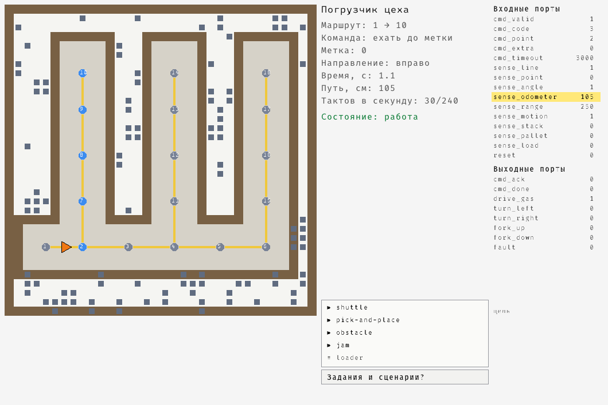
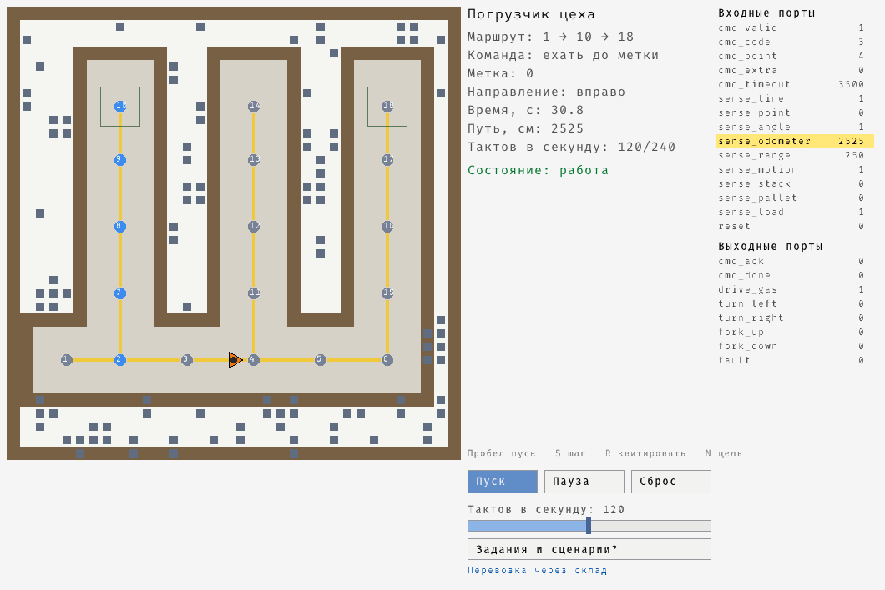
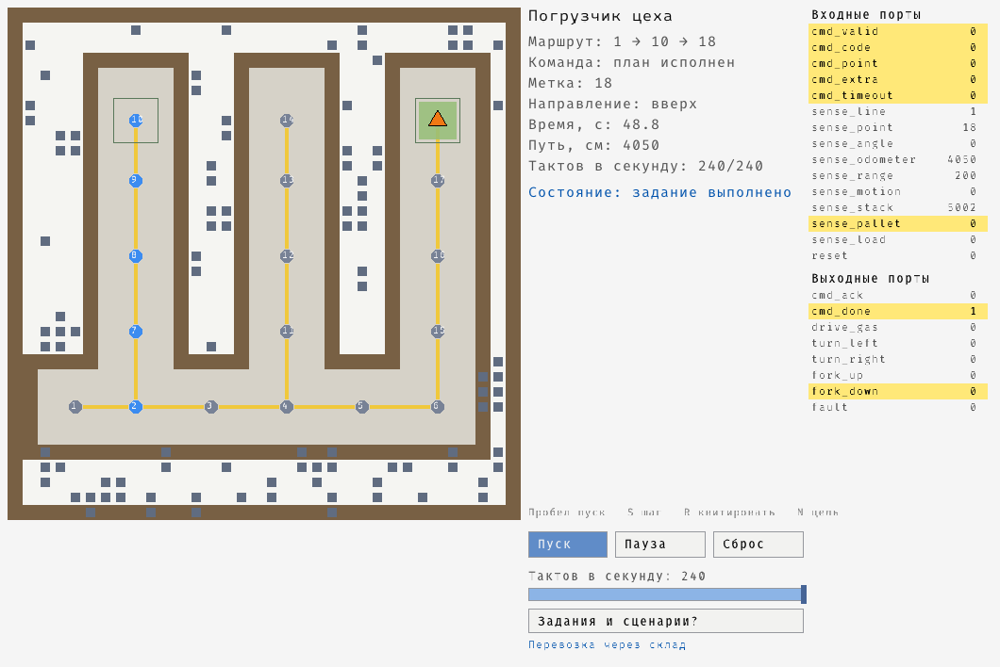
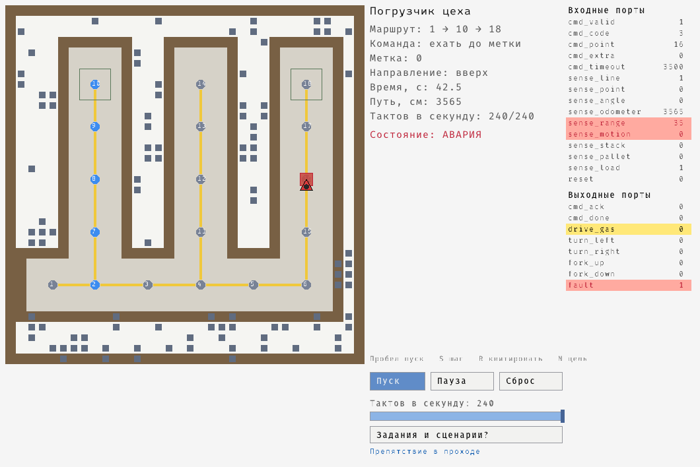
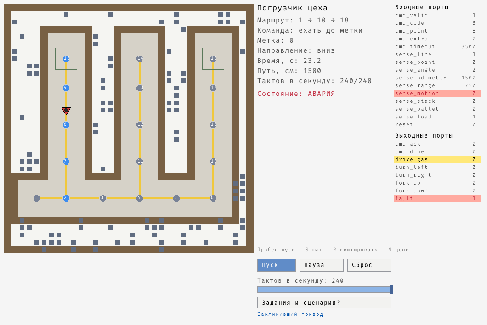

# 21-additional — дополнительные примеры

Материал, не привязанный к одной лекции. Сейчас здесь один пример —
**транспортный погрузчик цеха**: он едет по разметке на полу, узнаёт своё
место по меткам RFID и по заданию добирается до нужной точки. Перенесён из
репозитория [c_fsm](https://github.com/BasePractice/c_fsm)
(`fsm/transport_loader.c`, `fsm/factory.json`, `fsm/gui/transport_loader_gui.cpp`)
в рамках ТД-9.

Пример показывает то, чего в остальном практикуме нет: **установку, описанную
не кодом, а внешней конфигурацией**, и **разделение планирования и
управления**.

## Разделение по каталогам

| Каталог | Что там |
|---|---|
| `loader/` | сам погрузчик: система управления, планировщик, конфигурация цеха, модель установки, тесты |
| `loader-gui/` | графическая составляющая на C++ (raylib), необязательная цель |

Правило курса для такого материала: **система управления — на Takt, всё
остальное — чистый Си, графика — C++**.

| Файл | Язык | Что делает |
|---|---|---|
| `loader/model/loader.takt` | Takt | **система управления**: приём команды, движение, вилы, сторож по датчикам, таймер команды, владелец аварии |
| `loader/factory_map.[ch]` | C90 | конфигурация цеха: разбор подмножества JSON, слои карты, метки |
| `loader/route.[ch]` | C90 | планировщик: маршрут между метками и разворачивание его в команды |
| `loader/loader_plant.[ch]` | C90 | модель цеха: физика в сантиметрах и миллисекундах, показания датчиков |
| `loader/scenario.[ch]` | C90 | чтение сценария входных портов — того же файла, что прогоняет `takt-sim` |
| `loader/main.c` | C90 | инструмент: схема цеха, метки, маршрут и план команд |
| `loader/loader_runner.[ch]` | C99 | связка автомата с установкой: одна на драйвер и на графику |
| `loader/loader_main.c` | C99 | драйвер: прогон с потактовой трассой и проверкой исхода |
| `loader/loader_tests.cpp` | C++ | тесты планировщика, конфигурации и модели цеха |
| `loader-gui/loader_gui.cpp` | C++ | наблюдение за прогоном: карта, погрузчик, панель состояния |
| `loader/factory.json` | — | цех из оригинала: магистраль и три прохода между стеллажами, 18 меток |
| `loader/factory-grid.json` | — | решётка 3 × 3: конфигурация, на которой видна цена поворота |
| `loader/mission/*.json` | — | задания склада: доехать, взять паллету, отвезти, поставить |
| `loader/scenario/loader.json` | — | потактовый сценарий модели для `takt-sim` и отладки |

Единственная часть, зависящая от компилятора Takt, — `loader_runner` и всё,
что его использует. Планировщик, конфигурация и модель установки собираются
всегда, и тесты на них проходят даже там, где `taktc` не установлен.

## Как это работает

Конфигурация задаёт три слоя одинакового размера. Предмет примера — слой
`paths`: `0` — линии нет, `1…90` — метка RFID с этим номером, `91` —
горизонтальный участок, `92` — вертикальный.

```
#  o #..|..#   #..|..#   #..|..# #     a … i — метки 10 … 18
# ooo#..7..#   #..b..#   #..f..# #     | и - — участки линии
######..|..#####..|..#####..|..#o#     # — стена или стеллаж
##......|.........|.........|..oo#     . — покрытие проезда
##..1---2----3----4----5----6..oo#     o — оборудование (слой things)
```

Ехать по клетке с меткой можно в любую сторону, по участку — только вдоль
него, а **поворачивать разрешено только на метке**. Правило не выдумано под
реализацию: в исходной конфигурации метки стоят ровно на пересечениях
магистрали с проходами, то есть там, где линия и поворачивает.

Разделение обязанностей:

- **планировщик** (`route.c`) ищет маршрут — задача с памятью (очередь,
  пометки посещённого), конечным автоматом она не решается;
- **автомат** (`model/loader.takt`) исполняет команды по одной: «повернуть
  налево», «ехать до метки 7», «поднять груз».

Попытка впихнуть поиск пути в автомат управления и даёт те «автоматы» на сотню
состояний, о которых лекция 7 говорит как о симптоме.

Автомат собран из шести параллельных моделей: `CommandReceiver` (приём и
квитирование команды), `DriveController` (повороты и движение), `LiftController`
(вилы), `SafetyMonitor` (перебег по энкодеру и препятствие по дальномеру),
`CommandWatchdog` (команда обязана уложиться в отведённое время) и `FaultLatch`
(единственный владелец признака аварии).

### Физика приходит с датчиков

Правило, которому подчинена вся модель: **ни одна физическая величина не
вычисляется счётом тактов**. Такт — шаг логики, его частоту задаёт платформа, и
«двадцать тактов» на другом устройстве означают другое расстояние и другое
время. Поэтому автомат получает:

| Датчик | Что даёт | Что на нём построено |
|---|---|---|
| разметка под погрузчиком | `sense_line` | движение прекращается при потере линии |
| считыватель RFID | `sense_point` | сверка каждой метки с ожидаемой |
| энкодер | `sense_odometer`, см | перебег: от метки до метки не больше 4 м |
| дальномер | `sense_range`, см | препятствие ближе 40 см — стоп |
| акселерометр | `sense_motion` | подтверждение, что погрузчик тронулся |
| сканер места | `sense_stack` | код штабеля сверяется с заданием |
| сканер вил | `sense_pallet` | код паллеты сверяется с заданием |
| тензодатчик вил | `sense_load` | груз действительно принят |

Время в модели остаётся ровно в одном месте — в сторожевом таймере команды, и
срок ему считает **планировщик**: он знает длину перегона и паспортную скорость
машины (`LoaderTiming` в `route.h`), а автомат этот срок только сторожит. Отказ,
при котором датчики молчат, — двигатель включён, а погрузчик буксует или ползёт
медленнее расчётного — ловится только так.

## Запуск

```bash
cd build/practices/21-additional/loader   # рядом с исполняемым файлом лежат конфигурации
./21-additional map                       # схема цеха
./21-additional points                    # метки и их координаты
./21-additional route 1 10 --dir right    # маршрут и план команд
./21-additional route 1 9 --file factory-grid.json --turn-cost 5

./21-additional-run --from 1 --to 10 --dir right   # прогон автомата на модели цеха
```

Инструменты Takt внешние: каталог с `taktc` и `takt-sim` задаётся переменной
`STATECRAFT_TAKT_DIR` (по умолчанию `~/.local/bin`, затем `PATH`). Без `taktc`
цели `21-additional-run` и `21-additional-gui` не собираются, остальное
работает.

## Графическая составляющая

```bash
cmake -S . -B build -DSTATECRAFT_BUILD_GUI=ON     # нужна raylib
cmake --build build --target 21-additional-gui
./build/practices/21-additional/loader-gui/21-additional-gui --from 1 --to 18
```

В окне: кнопки **Пуск**, **Пауза**, **Сброс**, ползунок частоты тактирования и
панель всех портов автомата — входных и выходных. Значение, изменившееся с
прошлого такта, подсвечивается: по неподвижной таблице не видно, какой датчик
шевельнулся и какая команда снялась.

С клавиатуры: `Пробел` — пуск и пауза, `S` — один такт, `↑`/`↓` — скорость,
`R` — квитировать аварию, `N` — следующее задание, `Esc` — выход.



**Кнопка «Задания и сценарии…»** раскрывает список файлов из каталогов
`mission/` и `scenario/`, лежащих рядом с приложением. Задание (▶) прогоняется
на модели цеха — видно, как погрузчик едет, забирает паллету и ставит её на
свободное место; сценарий (≡) подаёт значения портов по тактам, установка при
этом не тикает. Файлового диалога в raylib нет, а тащить системный ради
учебного примера незачем.

**Красная подсветка** отмечает значение, при котором работать нельзя: пропала
разметка, препятствие ближе 40 см, чужая метка или чужой код, перебег по
энкодеру, команда «ехать» есть, а акселерометр показывает, что движения нет.
Правила те же, что в модели, — панель показывает не мнение приложения, а то, на
что смотрит автомат.

### Задания

Паллета взята и едет через склад: место 10 опустело, `sense_load` = 1, груз
виден на вилах.



Задание выполнено: паллета стоит на месте 18, вилы пусты.



| Файл | Что показывает |
|---|---|
| `mission/pick-and-place.json` | паллета из левого прохода переезжает в правый край склада |
| `mission/shuttle.json` | перестановка в соседний проход, старт из середины магистрали |
| `mission/obstacle.json` | проход перегорожен у метки 16: паллета взята, но проехать нельзя |
| `mission/jam.json` | привод заклинивает после 30 клеток: паллета взята, но погрузчик встал |

Два последних — отказы, и ловятся они разными средствами.

**Препятствие** видно заранее: дальномер отсчитывает 55, 50, 45, 40 см, и на
35 см система управления снимает газ и поднимает аварию, не доехав до
перегороженной клетки. В окне клетка залита красным, `sense_range`
подсвечивается красным, погрузчик стоит с грузом на вилах.



**Заклинивший привод** датчикам положения не виден вовсе: линия под
погрузчиком, меток нет, препятствий нет, а машина стоит. Ловит его сторожевой
таймер команды, а красным отмечается `sense_motion` — идёт команда «ехать», а
акселерометр показывает ноль.



Снимки сделаны самим приложением: ключи `--frames N --shot ФАЙЛ` рисуют N
кадров и сохраняют последний. Ими же проверяется, что графика вообще работает,
— окно при этом не остаётся висеть.

```bash
./21-additional-run --mission mission/pick-and-place.json       # в консоли
./21-additional-gui --mission mission/obstacle.json --speed 240 # в окне
```

Подписи набираются **Fira Code** — тем же шрифтом, что и весь курс: он
моноширинный, и таблица портов в нём выстраивается по колонкам сама. Шрифт
ищется в системе (в том числе в домашнем каталоге пользователя) либо задаётся
ключом `--font`; не нашёлся — подписи выводятся латиницей.

Три решения, принятые для этой цели:

- **приложение ничего не решает само.** Оно рисует состояние того же прогона
  (`loader_runner.h`), который проверяется тестом в консольном драйвере.
  Картинка со своей копией логики рано или поздно начнёт показывать не то, что
  происходит, а такая картинка хуже отсутствующей;
- **цель выключена по умолчанию.** raylib нет ни в CI, ни на машине без
  графики; сборка курса не должна от неё зависеть. При `-DSTATECRAFT_BUILD_GUI=ON`
  и отсутствующей raylib цель пропускается с предупреждением;
- **кириллица требует внешнего шрифта.** Во встроенном шрифте raylib её нет.
  Шрифт ищется в типовых местах системы либо задаётся ключом `--font`; если не
  найден, подписи выводятся латиницей. В курс шрифт не входит — распространять
  чужой шрифт вместе с примером нельзя (та же причина, что в ТД-1 и ТД-7).

## Что исправлено против оригинала

Переносить код как есть было нельзя.

**Автомата в оригинале нет.** `transport_loader_gui.cpp` подключает готовый
автомат `Parallel` из чужого репозитория (`fsmvm`, пути
`/Users/pastor/github/fsmvm/gen/c/position.c` и `E:/GitHub/fsmvm/...`), которого
нет ни в `c_fsm`, ни в открытом доступе. Без него графическое приложение не
собирается вовсе. Поэтому система управления написана заново — на Takt.

**Консольная часть оригинала не имеет отношения к конфигурации.**
`transport_loader_main.c` читает `factory.json` и тут же его игнорирует: дальше
идёт поиск в глубину по вшитому в файл лабиринту 10 × 10. В том же поиске
`uint8_t x = c.x + DIRECTIONS[i][0]` при движении влево даёт 255, а проверка
`x >= 0` для беззнакового типа тождественно истинна; массив координат рассчитан
на 50 элементов при 100 клетках поля.

**Поиск пути читал за границами матрицы.** `PathLine::search` вызывает
`matrix_get(path, row, col)` и только после этого сравнивает `col >= 0 && col <
size` — то есть выходит за пределы на каждой клетке у края карты. Тест
`обращение за пределы карты не читает чужую память` это фиксирует.

**Поиск не различал участки линии и не считал повороты.** Оригинал ходил по
любой непустой клетке слоя `paths`, хотя сам же кодировал горизонтальные и
вертикальные участки разными числами. Повороты он не учитывал вовсе, а поворот
погрузчика стоит дороже клетки пути. Здесь цена поворота — параметр поиска, и
поэтому нужен не поиск в ширину, а Дейкстра по состояниям «клетка +
направление»: в одну и ту же клетку приходят с разных сторон, и цена
дальнейшего пути от стороны зависит. Разница видна на `factory-grid.json`.

**Прочитанная метка ни с чем не сверялась.** Оригинал слал приводам команды по
списку; погрузчик, промахнувшийся мимо поворота, продолжал ехать «по плану».
В модели каждая встреченная метка сверяется с ожидаемой, и чужая метка —
авария.

**Не было предела движения.** Уехавший погрузчик останавливался только
оператором. `SafetyMonitor` поднимает аварию, если движение длится дольше
`BLIND_LIMIT` тактов без единой метки.

**cJSON заменён своим разбором.** Оригинал тянул 76 КБ стороннего кода ради
трёх матриц и требовал квадратной карты, не проверяя число строк: файл с лишней
строкой читался за пределы выделенной памяти. Здесь разбор занимает две сотни
строк, карта может быть прямоугольной, а несовпадение длин строк — ошибка с
номером строки файла.

## Что показала проверка на инструментах

Модель, драйвер и графика собраны и прогнаны: `taktc` компилирует
`model/loader.takt` без замечаний, сценарий `scenario/loader.json` проходит
все 23 шага, прогон 1 → 10 занимает 66 тактов и 23 клетки, 10 → 18 — 163 такта
и 58 клеток. Четыре вещи выяснились только на настоящих инструментах.

**Рукопожатие требует обеих половин.** Драйвер снимал `cmd_valid` и в том же
такте поднимал следующую команду. Автомат не успевал увидеть `cmd_valid = 0`,
навсегда оставался в состоянии `Reporting` с поднятым `cmd_done`, а драйвер,
глядя на этот сигнал, досчитывал план до конца — при неподвижном погрузчике.
Прогон показал это сразу: «исполнено 6 команд из 6, погрузчик на метке 2».
Теперь следующая команда подаётся только после того, как автомат снял
`cmd_done`.

**`taktc` заводит только те обработчики портов, которые нужны модели.** У
погрузчика нет числовых выходов, и `write_numeric` в порождённой структуре не
появился — драйвер, написанный по образцу чужого примера, из-за этого не
собирался.

**Порождённый заголовок не объявляет `extern "C"`.** При сборке графического
приложения это даёт «templates must have C++ linkage»: заголовок приходится
включать внутри собственного блока `extern "C"`, а стандартные заголовки — до
него.

**Картинка нашла ошибку чтения конфигурации.** Значение 13 в слое `map`
трактовалось как тело стеллажа — и на первом же снимке «стеллажи» оказались
ровно теми проходами, по которым едет погрузчик. На самом деле 13 — покрытие
проезда. Ни один тест этого не ловил: маршрут строится по слою `paths`,
которого ошибка не касалась.

**Попытка проверить свойство нашла дыру в модели.** Свойство безопасности
здесь одно: пока держится авария, погрузчик не едет — `G (faulted -> !moving)`.
Сторож (`SafetyMonitor`) поднимал аварию, но газ снимал не он, а
`DriveController` — на следующем такте, когда увидит `faulted`. Между «авария
поднята» и «привод остановлен» проходил такт; теперь газ снимает сам сторож.

Записать это свойство в модель как LTL всё равно не вышло: `taktc verify`
абстрагирует управление (условия переходов не учитываются, присваивания в
`enter` не отслеживаются), а состояния вложенных моделей при композиции вне его
охвата. Контрпример вида `[ Loader ]*` он выдаёт даже на модели из трёх
состояний — проверено отдельно. Поэтому свойство описано в модели словами, а
проверяется сценарием симулятора и прогоном.
